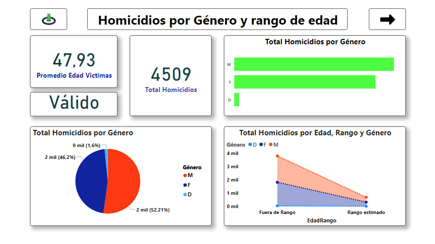
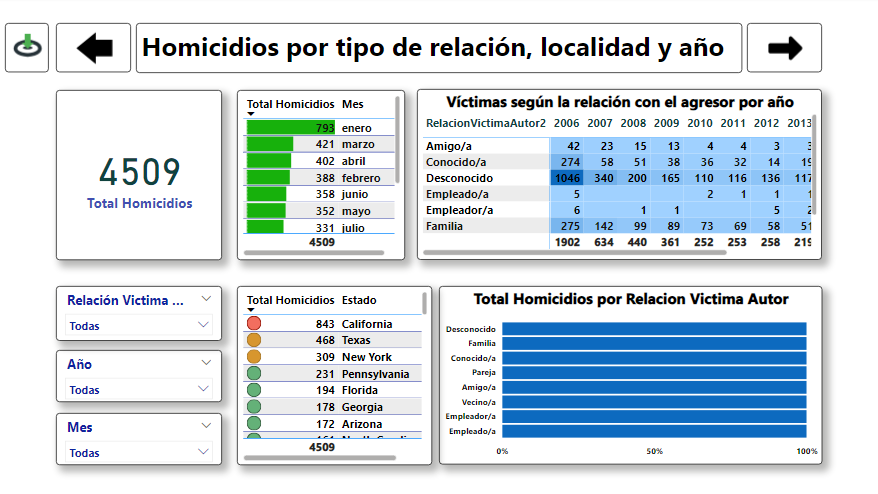
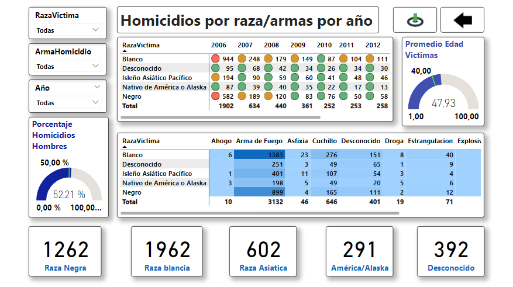

# Reporte Entrega Final Coder House 

## Explicación

Análisis centrado en el género, edad y promedio de edad de las victimas.

Análisis del tipo de relación de las victimas con el agresor, localidad, mes y año

Análisis centrado en la raza y armas en relación a las victimas

